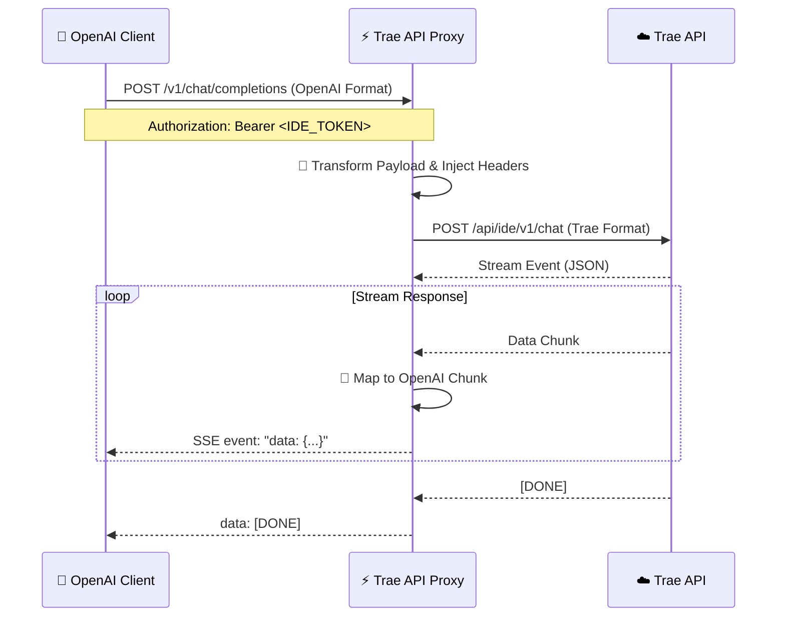

# ⚡ Trae API Proxy


> **Unlock Trae's Potential with OpenAI Compatibility**
>
> A high-performance, lightweight Go proxy that bridges the **Trae API** with the **OpenAI Standard API**. Seamlessly integrate Trae's AI capabilities into any tool, agent, or workflow that supports the OpenAI SDK.


---

## 📖 简介 (Introduction)

**Trae API Proxy** 是一个使用 Go 语言编写的中间件服务。它将标准的 OpenAI API 请求（如 Chat Completion）转换为 Trae API 所需的特定格式（包含复杂的 Header 签名和 Payload 结构），并将流式响应（SSE）完美映射回 OpenAI 格式。

这意味着你可以直接使用：
- 🦜 LangChain
- 🤖 AutoGen
- 💬 OpenAI Python/Node/Go SDK
- 📱 任何支持 OpenAI 接口的第三方客户端 (如 NextChat, ChatBox 等)

来调用 Trae 的后端模型能力。

## ✨ 核心特性 (Features)

- 🔄 **完全兼容 OpenAI 接口**: 支持 `/v1/chat/completions` 和 `/v1/models`。
- ⚡ **极致性能**: 基于 Go 语言开发，低延迟，高并发。
- 🌊 **完美流式响应**: 原生支持 Server-Sent Events (SSE)，打字机效果丝滑流畅。
- 🛡️ **工程化架构**: 采用 Standard Go Project Layout，结构清晰，易于维护。
- 📝 **开箱即用**: 简单的环境变量配置即可启动。

## 🏗️ 架构概览 (Architecture)



## 🚀 快速开始 (Getting Started)

### 1. 环境准备
- Go 1.25+
- 拥有 Trae 账号并获取相关的设备指纹信息。

### 2. 获取代码
```bash
git clone https://github.com/muskke/trae-api-proxy-go.git
cd trae-api-go
```

### 3. 配置环境变量
复制示例配置文件：
```bash
cp .env.example .env
```
编辑 `.env` 文件，填入抓包获取的 Trae Header 信息：
```ini
TRAE_APP_ID=...
TRAE_DEVICE_ID=...
TRAE_IDE_VERSION=...
# ... 其他必要字段
```

### 4. 运行服务
```bash
# 直接运行
go run cmd/trae-api/main.go

# 编译运行
go build -o trae-proxy ./cmd/trae-api
./trae-proxy
```
服务默认运行在 `:8000` 端口。

## 🔗 API 参考 (API Reference)

### Base URL
`http://localhost:8000/v1`

### 1. 获取模型列表
**GET** `/models`

```bash
curl http://localhost:8000/v1/models \
  -H "Authorization: Bearer YOUR_IDE_TOKEN"
```

### 2. 对话补全 (Chat Completions)
**POST** `/chat/completions`

支持非流式和流式 (`stream: true`)。

```bash
curl http://localhost:8000/v1/chat/completions \
  -H "Content-Type: application/json" \
  -H "Authorization: Bearer YOUR_IDE_TOKEN" \
  -d '{
    "model": "claude-3.5",
    "messages": [{"role": "user", "content": "Hello!"}],
    "stream": true
  }'
```

## 📂 项目结构 (Project Structure)

```text
.
├── 📂 cmd/           # 🚀 程序入口
│   └── trae-api/
├── 📂 internal/      # 🔒 私有业务逻辑
│   ├── config/       # 配置加载
│   ├── handler/      # HTTP 路由处理
│   └── service/      # 核心业务服务
└── 📂 pkg/           # 📦 公共工具库
```

## 🤝 贡献 (Contributing)

欢迎提交 Issue 和 Pull Request！让我们一起完善这个项目。

1. Fork 本仓库
2. 创建分支 (`git checkout -b feature/AmazingFeature`)
3. 提交更改 (`git commit -m 'Add some AmazingFeature'`)
4. 推送到分支 (`git push origin feature/AmazingFeature`)
5. 提交 Pull Request

## 📄 许可证 (License)

[MIT](LICENSE) © 2026 [Muskke](https://github.com/muskke)
