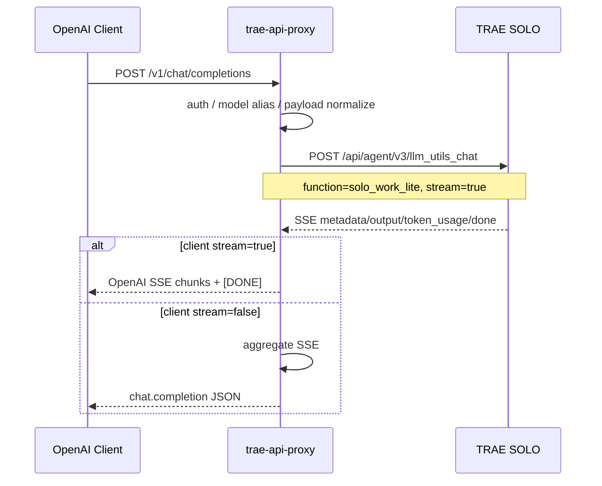

# ⚡ Trae API Proxy


一个轻量、单账号、零第三方 Go 依赖的 TRAE → OpenAI Chat Completions 兼容代理。

当前维护版已从旧的 `/api/ide/v1/chat` 升级到 TRAE SOLO 的 `llm_utils_chat` / `solo_work_lite` 调用链，同时保留旧协议回退，重点解决长期未维护后最容易出现的上游协议漂移、SSE 兼容、工具调用和运行稳定性问题。

## ✨ v0.3.0 重点

- **当前 SOLO 协议**：默认使用 `/api/agent/v3/llm_utils_chat`，模型参数按 `config_name` 转换。
- **兼容旧协议**：`TRAE_UPSTREAM_MODE=auto` 在当前端点返回 `404/405` 时自动回退 `/api/ide/v1/chat`。
- **OpenAI 兼容**：`GET /v1/models`、`POST /v1/chat/completions`，同时支持 `stream: true/false`。
- **SSE 重构**：支持 metadata、output、token usage、done、error；对缺失空行的 SSE 也能容错解析。
- **工具调用**：支持 OpenAI tools / tool_choice 请求转换、增量 tool_calls 返回以及非流式参数拼接。
- **Usage**：支持非流式 usage，以及 `stream_options.include_usage=true` 的最终 usage chunk。
- **动态模型**：优先从 `get_detail_param` 获取模型列表，带 TTL 缓存和 stale fallback。
- **模型映射**：支持 `TRAE_MODEL_ALIASES`，同时兼容 `model__suffix` 形式。
- **鉴权隔离**：可让客户端只持有本地 `AUTH_TOKEN`，真实 `TRAE_IDE_TOKEN` 仅保留在代理端。
- **运行可靠性**：请求体上限、首包超时、长 SSE 不设总超时、健康检查、优雅退出、request ID、可选 CORS。
- **零第三方依赖**：Go 代码只使用标准库，减少长期维护时的依赖漂移。
- **工程化**：补齐测试、GitHub Actions、Docker、Compose、Makefile 和变更日志。

> 项目仍保持“轻量单账号代理”的定位；多账号池、Web 管理后台、签到/额度管理不在本仓库 v0.3.0 的目标范围内。

## 🏗️ 调用链


```mermaid
sequenceDiagram
    participant Client as OpenAI Client
    participant Proxy as trae-api-proxy
    participant Trae as TRAE SOLO

    Client->>Proxy: POST /v1/chat/completions
    Proxy->>Proxy: auth / model alias / payload normalize
    Proxy->>Trae: POST /api/agent/v3/llm_utils_chat
    Note over Proxy,Trae: function=solo_work_lite, stream=true
    Trae-->>Proxy: SSE metadata/output/token_usage/done
    alt client stream=true
        Proxy-->>Client: OpenAI SSE chunks + [DONE]
    else client stream=false
        Proxy->>Proxy: aggregate SSE
        Proxy-->>Client: chat.completion JSON
    end
```

`auto` 模式下，如果当前 SOLO 聊天/模型端点明确返回 `404` 或 `405`，代理会尝试旧版 API；鉴权失败、限流、5xx 等错误不会错误地触发协议降级。

## 🚀 快速开始

### 环境

- **最低**：Go 1.23+
- **推荐维护环境**：Go 1.27.x

### 1. 配置

```bash
cp .env.example .env
```

最常用配置：

```dotenv
# 上游会话 Token
TRAE_IDE_TOKEN=your-trae-token

# 推荐设置一个仅给本地客户端使用的代理 Token
AUTH_TOKEN=your-local-proxy-token

TRAE_UPSTREAM_MODE=auto
TRAE_DEFAULT_MODEL=glm-5.2
PORT=8000
```

设备 ID / Machine ID / UID 等字段可按你自己的会话环境填写；当前 SOLO 必要的公共指纹默认值已内置，也可以用 `.env` 覆盖。

### 2. 运行

```bash
go run ./cmd/trae-api
```

或：

```bash
make check
./bin/trae-api-proxy
```

默认监听 `0.0.0.0:8000`。仅本机使用时建议设置：

```dotenv
BIND=127.0.0.1
```

## 🔐 三种 Token 使用方式

### 推荐：本地 Token 与上游 Token 分离

```dotenv
AUTH_TOKEN=my-local-key
TRAE_IDE_TOKEN=my-trae-token
```

客户端只发送：

```http
Authorization: Bearer my-local-key
```

代理验证本地 Token 后，再使用 `TRAE_IDE_TOKEN` 请求上游。

### 仅配置 TRAE_IDE_TOKEN

```dotenv
AUTH_TOKEN=
TRAE_IDE_TOKEN=my-trae-token
```

此模式下代理接口不额外要求客户端 Token，适合仅绑定 localhost 的个人环境。

### 请求级透传

如果两个变量都不设置，客户端的 Bearer Token（或 `X-API-Key`）会作为上游 Token 使用。

## 🔗 API

### 健康检查

无需鉴权：

```bash
curl http://127.0.0.1:8000/healthz
```

### 状态

```bash
curl http://127.0.0.1:8000/status \
  -H 'Authorization: Bearer my-local-key'
```

状态接口只返回运行模式、上游 host、是否配置 Token 等非敏感信息。

### 模型列表

```bash
curl http://127.0.0.1:8000/v1/models \
  -H 'Authorization: Bearer my-local-key'
```

### 非流式对话

```bash
curl http://127.0.0.1:8000/v1/chat/completions \
  -H 'Authorization: Bearer my-local-key' \
  -H 'Content-Type: application/json' \
  -d '{
    "model": "glm-5.2",
    "messages": [{"role": "user", "content": "你好"}],
    "stream": false
  }'
```

### 流式对话 + usage

```bash
curl -N http://127.0.0.1:8000/v1/chat/completions \
  -H 'Authorization: Bearer my-local-key' \
  -H 'Content-Type: application/json' \
  -d '{
    "model": "glm-5.2",
    "messages": [{"role": "user", "content": "写一个 Go hello world"}],
    "stream": true,
    "stream_options": {"include_usage": true}
  }'
```

## 🧰 Tool Calling

OpenAI 风格的 `tools` 会转换为 SOLO 所需格式，包括将 `function.parameters` JSON 对象序列化为上游要求的字符串；assistant 历史消息中的 `tool_calls.function` 会转换为 `function_call`。

支持的 `tool_choice`：

- `auto`
- `required`
- `none`
- OpenAI 的指定 function 对象

返回时会重新转换为 OpenAI `tool_calls`，非流式响应会按 index 拼接增量 arguments。

## 🗺️ 模型映射

例如客户端固定请求 `sonnet`，实际发送 `glm-5.2`：

```dotenv
TRAE_MODEL_ALIASES=sonnet=glm-5.2;fast=glm-5-turbo
```

映射 key 不区分大小写。`glm-5.2__dev` 这类内部后缀也会先归一化为 `glm-5.2`。

## ⚙️ 主要配置

| 变量 | 默认值 | 说明 |
|---|---|---|
| `BIND` | `0.0.0.0` | HTTP 监听地址 |
| `PORT` | `8000` | HTTP 端口 |
| `AUTH_TOKEN` | 空 | 可选的客户端本地 Token |
| `TRAE_IDE_TOKEN` | 空 | 上游 TRAE Token |
| `TRAE_UID` | 空 | 可选 UID |
| `TRAE_UPSTREAM_MODE` | `auto` | `auto` / `solo` / `legacy` |
| `TRAE_API_BASE_URL` | `https://trae-api-cn.mchost.guru` | TRAE Agent host |
| `TRAE_DEFAULT_MODEL` | `glm-5.2` | 空 model / `auto` 的默认模型 |
| `TRAE_MODEL_ALIASES` | 空 | `alias=model` 列表 |
| `TRAE_MODEL_CACHE_TTL` | `1h` | 模型列表缓存 |
| `TRAE_REQUEST_TIMEOUT` | `120s` | 短 JSON 请求总超时 |
| `TRAE_RESPONSE_HEADER_TIMEOUT` | `120s` | 上游首包/响应头超时 |
| `MAX_BODY_BYTES` | `8388608` | 客户端请求体上限（8 MiB） |
| `SHUTDOWN_TIMEOUT` | `10s` | 优雅退出等待时间 |
| `CORS_ALLOW_ORIGIN` | 空 | 留空关闭 CORS；按需设置来源 |

完整指纹配置见 [.env.example](.env.example)。

## 🐳 Docker

```bash
cp .env.example .env
# 编辑 .env

docker compose up -d --build
```

Compose 默认只把服务映射到宿主机 `127.0.0.1:${PORT}`；容器内部仍监听 `0.0.0.0`。

也可以直接构建：

```bash
docker build -t trae-api-proxy .
docker run --rm --env-file .env -p 127.0.0.1:8000:8000 trae-api-proxy
```

## 🧪 开发与验证

```bash
make test
make vet
make build
# 或一次执行
make check
```

测试完全使用 `httptest` 模拟上游，不依赖真实 TRAE Token，覆盖：

- SOLO payload 转换
- tools / tool_choice
- SSE 流式和非流式
- usage / tool call 增量拼接
- SOLO → legacy 自动回退
- 动态模型列表与缓存
- 本地 AUTH_TOKEN 与上游 Token 隔离
- dotenv 兼容解析

CI 在最低 Go 1.23 与当前 Go 1.27 两条工具链上运行 test / vet / build。

## ⬆️ 从 v0.2.0 升级

1. 备份你原来的 `.env`。
2. 对照新的 `.env.example` 补充 `TRAE_UPSTREAM_MODE=auto`。
3. 推荐把 `TRAE_API_BASE_URL` 改为当前默认的 `https://trae-api-cn.mchost.guru`。
4. 旧版设备字段仍可继续使用；未配置的公共 SOLO 指纹会采用当前默认值。
5. 如果你明确只想跑旧接口，可设置 `TRAE_UPSTREAM_MODE=legacy`。
6. 客户端 API 路径仍然是 `/v1/models` 和 `/v1/chat/completions`，无需迁移客户端代码。

详细记录见 [CHANGELOG.md](CHANGELOG.md)。

## 🔎 这次升级参考的公开项目

协议和工程实现对照了以下公开仓库，但本项目保持自己的轻量单账号定位：

- [Sliverkiss/traework2api](https://github.com/Sliverkiss/traework2api) — 当前 SOLO upstream / OpenAI 转换实现参考。
- [connectedGraph/trae2api-web](https://github.com/connectedGraph/trae2api-web) — 动态模型、SSE、健康检查、错误处理与工程化实现参考。
- [wanlibeiqiu/local-proxy](https://github.com/wanlibeiqiu/local-proxy) — SSE 拼装、模型映射、本地 key 隔离等代理设计参考。

## 📂 目录

```text
.
├── cmd/trae-api/              # 服务入口
├── internal/config/           # 配置与校验
├── internal/handler/          # OpenAI HTTP API / 鉴权 / 错误映射
├── internal/middleware/       # request ID / CORS / 日志 / recovery
├── internal/service/trae/     # SOLO + legacy upstream / payload / SSE
├── pkg/utils/                 # dotenv 工具
├── .github/workflows/ci.yml   # CI
├── Dockerfile
├── docker-compose.yml
├── Makefile
└── CHANGELOG.md
```

## ⚠️ 兼容边界

当前版本专注于 Chat Completions 链路，不实现 embeddings、images、audio、OpenAI Responses API 或多账号池。上游并非公开稳定 API，因此后续 IDE/服务端升级仍可能导致协议变化；`auto` + `legacy` 回退和离线测试是为了让下一次维护成本更低，而不是承诺上游永远不变。

## 📄 License

MIT，见 [LICENSE](LICENSE)。
