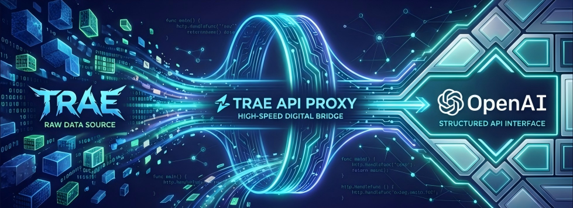

# ⚡ Trae API Proxy



一个轻量、单账号、零第三方 Go 运行依赖的 TRAE → OpenAI Chat Completions 兼容代理。

**v0.4.4 是针对真实 Global SG 长连接测试做的稳定性收尾版。** 在 v0.4.3 的模型可用性学习基础上，它修复了 `progress_notice` 等辅助 SSE 事件可能中断输出的问题，把模型状态持久化到 `data/model-status.json`，增加 reasoning 输出兼容模式，并让启动日志与 `/status` 显示真实会话上游，而不是旧配置占位值。

> 如果你使用的是 TRAE Global IDE，通常只需要保持 `TRAE_OAUTH_PLATFORM=global`，不要再手工指定旧的 `trae.cn`、SOLO client id 或 v0.4.0 登录 URL。

## ✨ v0.4.4 重点

- **SSE 辅助事件容错**：`progress_notice`、heartbeat、未来未知事件即使携带 string/null/非 JSON 数据，也不会再把正常聊天流打断；只有真正需要对象结构的核心事件才严格解析。
- **模型状态跨重启持久化**：`usable` / `unavailable` 学习结果默认原子写入 `data/model-status.json`，重启后继续使用，过期条目自动回到 `unknown`。
- **Reasoning 兼容模式**：`TRAE_REASONING_MODE=preserve|merge|drop`，可兼容支持 `reasoning_content` 的新客户端和只认 `delta.content` 的旧客户端。
- **真实上游诊断**：启动日志与 `/status` 直接展示当前 OAuth 会话的 chat upstream / region / platform / function / OAuth host，避免日志仍显示旧默认值而实际请求已走 Global Core host。

- **模型可用性学习**：模型目录中的条目先是 `unknown`；真实成功调用记为 `usable`；最小标准请求明确返回 TRAE `4001` 时暂记为 `unavailable`。
- **默认模型列表去坑**：`GET /v1/models` 默认隐藏当前账号负缓存中的模型，同时保留尚未验证的 `unknown` 模型；可用 `availability=` 查询不同视图。
- **模型诊断接口**：`GET /v1/models/status` 查看状态、函数、最后错误与缓存过期时间；`DELETE /v1/models/status?model=...` 可立即清除某个模型状态重新验证。
- **避免误判**：带 tools、temperature 等额外参数的复杂请求即便收到 `4001`，也不会因此把模型本身拉黑。
- **会话隔离**：模型目录和能力状态按账号 / 产品 / 上游 host 隔离，切换账号或区域不会串缓存。
- **Global 对话路由修复**：标准 TRAE 使用 `chat_v3`，只有 `global-solo` / `cn-solo` 使用 `solo_work_lite`。
- **Global Core Host 修复**：SG 默认 `https://coresg-normal.trae.ai`，US 默认 `https://coreva-normal.trae.ai`，旧 v0.4.1 自动生成的 SG/US host 启动时自动迁移。
- **真实回调区域优先**：优先采用 callback 的 `userRegion` / `host` 元数据，避免仅靠登录域名推断区域。
- **Global TRAE 默认模式**：默认 `TRAE_OAUTH_PLATFORM=global`，标准 TRAE 使用 Global 登录与账号接口。
- **LoginGuidance**：`/auth/login` 不再硬编码旧授权域名，而是先获取当前可用 LoginHost。
- **PKCE S256**：授权 URL 包含 `code_challenge` / `code_challenge_method=S256`，本地保存一次性 verifier 用于换票。
- **当前 AuthCode 流程**：回调默认使用 `http://127.0.0.1:18080/authorize`，支持 `authCodeInfo/AuthCode` 后再 ExchangeToken。
- **多平台兼容**：`global`、`global-solo`、`cn`、`cn-solo` 四种认证平台可选。
- **本机 IDE 元数据发现**：同机安装 TRAE 时，优先从 `product.json` 获取 appVersion、tronBuildVersion 和匹配产品的 auth client id；环境变量仍拥有最高优先级。
- **区域化上游**：托管凭证记录登录区域，Global SG/US 与 CN 会选择对应 Agent API host。
- **自动续期**：默认 access token 到期前 24 小时刷新，每 15 分钟检查一次。
- **refresh token 轮换**：换票返回新 refresh token 时与 access token 一起原子落盘。
- **401/403 自愈**：OAuth 会话真实请求遇到鉴权失败时，强制刷新一次并仅重试原请求一次。
- **兼容 v0.4.0**：旧 refreshToken/userJwt callback 与 v1 凭证文件仍可迁移；旧 CN/SOLO 凭证会按原产品推断。
- **兼容静态 Token**：`TRAE_IDE_TOKEN` 仍可作为静态模式或 `auto` fallback。
- **OpenAI 兼容**：模型列表、流式/非流式 Chat Completions、reasoning、usage、tools / tool_choice / tool_calls。

> 项目仍保持“轻量单账号代理”的定位；多账号池、账号运营后台、签到/额度管理不在当前范围内。

## 🏗️ 调用链

```text
首次登录（Global 默认）：
Browser → :8000/auth/login
              ↓
        GetLoginGuidance
              ↓
trae.ai /authorization + PKCE
              ↓
        :18080/authorize
              ↓
      AuthCode + CodeVerifier
              ↓
         ExchangeToken
              ↓
 access + refresh + expiry + region
              ↓
      data/trae-auth.json

日常请求：
OpenAI Client → trae-api-proxy → AuthManager → TRAE Agent API
                                  │
                                  ├─ 到期前：自动 refresh
                                  ├─ 401/403：refresh + retry once
                                  └─ SG / US / CN：按会话区域路由
```

## 🚀 快速开始：TRAE Global 推荐配置

### 环境

- Go 1.23+
- CI 同时覆盖 Go 1.23 与当前 Go 工具链

### 1. 配置

```bash
cp .env.example .env
```

本地 Global TRAE 最少建议：

```dotenv
BIND=127.0.0.1
PORT=8000
AUTH_TOKEN=my-local-proxy-key

TRAE_AUTH_MODE=auto
TRAE_AUTH_FILE=./data/trae-auth.json
TRAE_OAUTH_PLATFORM=global
TRAE_IDE_TOKEN=
TRAE_OAUTH_CALLBACK_PORT=18080
```

`AUTH_TOKEN` 是 OpenAI 客户端访问这个代理使用的本地 key，与 TRAE 登录凭证完全分离。

如果你从 v0.4.0 升级，而且 `.env` 里曾手工加入这些旧值：

```dotenv
TRAE_OAUTH_HOST=https://api.trae.com.cn
TRAE_OAUTH_CONSOLE_URL=https://www.trae.cn/authorization
TRAE_OAUTH_CLIENT_ID=en1oxy7wnw8j9n
TRAE_OAUTH_PLUGIN_VERSION=2.3.62834
TRAE_IDE_VERSION=0.1.52
```

**Global 用户应删除这些覆盖项，或改用新版 `.env.example`。** 否则环境变量优先级会主动覆盖当前 Global/自动发现逻辑。

### 2. 启动

```bash
go run ./cmd/trae-api
```

或：

```bash
make check
./bin/trae-api-proxy
```

### 3. 首次登录 TRAE

在**运行代理的同一台机器**打开：

```text
http://127.0.0.1:8000/auth/login
```

Global 标准 TRAE 正常情况下会：

1. 代理向 Global LoginGuidance 获取当前 LoginHost；
2. 浏览器跳转到 `trae.ai` 体系的 `/authorization`；
3. URL 中包含 `auth_from=trae`、PKCE `code_challenge` 和 `code_challenge_method=S256`；
4. TRAE 完成登录后回调 `http://127.0.0.1:18080/authorize`；
5. 代理用 AuthCode + CodeVerifier + DeviceInfo 换取会话；
6. 自动保存 `data/trae-auth.json` 并开始自动刷新。

如果同机安装了 TRAE IDE，代理会尝试读取其 `product.json`，以跟随当前安装版本的 `appVersion`、`tronBuildVersion` 与 auth client id。可用 `TRAE_APP_PATH` 指定安装目录或 `product.json`；显式环境变量仍然优先。

### 4. 确认登录状态

```bash
curl http://127.0.0.1:8000/auth/status \
  -H 'Authorization: Bearer my-local-proxy-key'
```

正常会看到类似：

```json
{
  "mode": "auto",
  "source": "oauth",
  "authenticated": true,
  "refreshable": true,
  "auto_refresh": true,
  "needs_refresh": false,
  "platform": "global",
  "login_region": "sg",
  "uid": "...",
  "expires_at": 1788600000,
  "refresh_expires_at": 1800000000
}
```

不会返回真实 access token / refresh token。

## 🌍 认证平台

| `TRAE_OAUTH_PLATFORM` | 用途 | 默认 auth_from | 默认区域 |
|---|---|---|---|
| `global` | 标准 TRAE Global / `trae.ai` | `trae` | Global / SG |
| `global-solo` | TRAE SOLO Global | `solo` | Global / SG |
| `cn` | 标准 TRAE China / `trae.cn` | `trae` | CN |
| `cn-solo` | TRAE SOLO China | `solo` | CN |

默认是 `global`。Global 登录后如服务返回 US/USTTP 区域，后续 Agent API 可切到 US；CN 登录使用 CN Agent API。

高级用户可以覆盖 `TRAE_OAUTH_HOST`、`TRAE_OAUTH_CONSOLE_URL`、`TRAE_OAUTH_CLIENT_ID`、`TRAE_OAUTH_GUIDANCE_URLS` 和 ExchangeToken/UserInfo 路径，但一般不建议覆盖。

## 🔄 自动续期逻辑

```text
access token 剩余 > 24h
    → 直接使用

access token 剩余 <= 24h
    → ExchangeToken(refresh token)
    → 保存新的 access token
    → 如果返回新 refresh token，同时轮换保存

真实上游请求返回 401/403
    → 强制 ExchangeToken 一次
    → 清模型缓存
    → 原请求重试一次

refresh token 已过期 / 被撤销
    → reauth_required
    → 再访问 /auth/login 完成一次网页登录
```

手工刷新：

```bash
curl -X POST http://127.0.0.1:8000/auth/refresh \
  -H 'Authorization: Bearer my-local-proxy-key'
```

退出并删除本地托管凭证：

```bash
curl -X POST http://127.0.0.1:8000/auth/logout \
  -H 'Authorization: Bearer my-local-proxy-key'
```

## 🔐 认证模式

### `TRAE_AUTH_MODE=auto`（推荐）

优先级：

```text
有效的 data/trae-auth.json
       ↓ 无
TRAE_IDE_TOKEN
       ↓ 无
请求中的 Bearer / X-API-Key
```

如果设置了 `AUTH_TOKEN`，客户端 Bearer 是本地代理 key，不会被误当成 TRAE Token。

### `TRAE_AUTH_MODE=oauth`

只接受浏览器登录产生的托管凭证。没有有效会话时返回 `reauth_required`。

### `TRAE_AUTH_MODE=token`

静态 Token 兼容模式：

```dotenv
TRAE_AUTH_MODE=token
TRAE_IDE_TOKEN=your-trae-access-token
TRAE_UID=
TRAE_DEVICE_ID=
TRAE_MACHINE_ID=
```

不做 OAuth 自动续期。

### `TRAE_AUTH_MODE=passthrough`

客户端请求中的 Bearer Token / `X-API-Key` 直接作为 TRAE Token。

## 🔗 API

| Method | Path | 用途 |
|---|---|---|
| `GET` | `/healthz` | 健康检查，无需鉴权 |
| `GET` | `/status` | 服务 + 安全认证状态 |
| `GET` | `/auth/status` | OAuth 生命周期状态 |
| `GET` | `/auth/login` | 从 localhost 发起 TRAE 浏览器登录 |
| `GET` | `/authorize` | 当前 TRAE 本机 OAuth callback |
| `GET` | `/auth/callback/{state}` | v0.4.0 兼容 callback |
| `POST` | `/auth/refresh` | 手工强制刷新一次 |
| `POST` | `/auth/logout` | 删除本地托管凭证 |
| `GET` | `/v1/models` | OpenAI-compatible 模型列表；支持 `availability=` 过滤 |
| `GET` | `/v1/models/status` | 当前账号模型能力状态与最近错误 |
| `DELETE` | `/v1/models/status` | 清除当前账号模型状态；可传 `?model=` |
| `POST` | `/v1/chat/completions` | OpenAI-compatible Chat Completions |

### 模型列表与可用性

默认列表包含 `unknown + usable`，并自动隐藏当前账号最近已经用“最小标准请求”验证为 `unavailable` 的模型：

```bash
curl 'http://127.0.0.1:8000/v1/models' \
  -H 'Authorization: Bearer my-local-proxy-key'
```

可按状态查看：

```bash
# 只看已经真实调用成功过的模型
curl 'http://127.0.0.1:8000/v1/models?availability=usable' \
  -H 'Authorization: Bearer my-local-proxy-key'

# 看完整上游目录，包括当前负缓存模型
curl 'http://127.0.0.1:8000/v1/models?availability=all' \
  -H 'Authorization: Bearer my-local-proxy-key'

# 看模型状态、最近错误与过期时间
curl 'http://127.0.0.1:8000/v1/models/status' \
  -H 'Authorization: Bearer my-local-proxy-key'
```

如果某模型的权限/区域状态已经变化，可以不等负缓存过期，立即清除并重试：

```bash
curl -X DELETE 'http://127.0.0.1:8000/v1/models/status?model=DeepSeek-V4-Flash' \
  -H 'Authorization: Bearer my-local-proxy-key'
```

> v0.4.4 仍不会在启动时逐模型主动探测，因此不会为了“验证列表”自动消耗额度。`unknown` 只有在真实请求成功/明确失败后才会变成 `usable` / `unavailable`；学习结果会持久化到本地状态文件并受 TTL 控制。

### Reasoning 输出兼容

默认保持 TRAE 的独立思考字段：

```dotenv
TRAE_REASONING_MODE=preserve
```

三种模式：

| 模式 | 行为 | 适用客户端 |
|---|---|---|
| `preserve` | `reasoning_content` 与最终 `content` 分开输出 | 支持推理字段的新客户端 |
| `merge` | 把 reasoning token 合并到 `content` | 只读取 OpenAI 标准 `content` 的旧客户端 |
| `drop` | 丢弃 reasoning，仅输出最终答案 | 不希望接收思考流的客户端 |

聊天响应会带 `X-Trae-Reasoning-Mode` 便于诊断。

### 非流式对话

```bash
curl http://127.0.0.1:8000/v1/chat/completions \
  -H 'Authorization: Bearer my-local-proxy-key' \
  -H 'Content-Type: application/json' \
  -d '{
    "model": "glm-5.2",
    "messages": [{"role": "user", "content": "你好"}],
    "stream": false
  }'
```

### 流式对话 + usage

```bash
curl -N http://127.0.0.1:8000/v1/chat/completions \
  -H 'Authorization: Bearer my-local-proxy-key' \
  -H 'Content-Type: application/json' \
  -d '{
    "model": "glm-5.2",
    "messages": [{"role": "user", "content": "写一个 Go hello world"}],
    "stream": true,
    "stream_options": {"include_usage": true}
  }'
```

### Windows Git Bash 中文请求

代理内部按 UTF-8 保留 OpenAI message 文本；但 `Git Bash -> Windows curl.exe` 直接把中文放进命令行参数时，Windows 参数编码可能先把内容改坏。推荐把 JSON 写成 UTF-8 文件并用 `--data-binary`：

```bash
cat > request.json <<'EOF'
{
  "model": "minimax-m3",
  "messages": [{"role": "user", "content": "用三句话介绍 Go"}],
  "stream": true,
  "stream_options": {"include_usage": true}
}
EOF

curl.exe -N http://127.0.0.1:8000/v1/chat/completions \
  -H "Authorization: Bearer my-local-proxy-key" \
  -H "Content-Type: application/json; charset=utf-8" \
  --data-binary @request.json
```

也可以把中文写成 JSON `\uXXXX` 转义，确保 shell 参数本身全是 ASCII。

## 🧰 Tool Calling

OpenAI 风格的 `tools` / `tool_choice` 会转换为 SOLO 所需结构；上游增量 function call 会重新拼接为 OpenAI `tool_calls`。支持：

- `tool_choice: "auto"`
- `"required"`
- `"none"`
- 指定 function 对象
- assistant 历史中的 `tool_calls`
- `role=tool` 的工具结果回传

## 🗺️ 模型映射

```dotenv
TRAE_MODEL_ALIASES=sonnet=glm-5.2;fast=glm-5-turbo
```

映射 key 不区分大小写；`model__suffix` 形式也会先归一化。

## ⚙️ 主要配置

| 变量 | 默认值 | 说明 |
|---|---|---|
| `BIND` | `0.0.0.0` | HTTP 监听地址；`.env.example` 预设 `127.0.0.1` |
| `PORT` | `8000` | HTTP 端口 |
| `AUTH_TOKEN` | 空 | 客户端访问代理的本地 key |
| `TRAE_AUTH_MODE` | `auto` | `auto` / `oauth` / `token` / `passthrough` |
| `TRAE_AUTH_FILE` | `./data/trae-auth.json` | 托管 OAuth 凭证 |
| `TRAE_OAUTH_PLATFORM` | `global` | `global` / `global-solo` / `cn` / `cn-solo` |
| `TRAE_IDE_TOKEN` | 空 | 静态 Token / auto fallback |
| `TRAE_APP_PATH` | 空 | 可选安装目录或 `product.json`，用于发现 IDE 产品参数 |
| `TRAE_OAUTH_CALLBACK_PORT` | `18080` | 本机 OAuth callback listener |
| `TRAE_OAUTH_CALLBACK_BASE_URL` | 自动 `http://127.0.0.1:18080` | 高级回调基址 |
| `TRAE_OAUTH_REFRESH_SKEW` | `24h` | 提前多久刷新 access token |
| `TRAE_OAUTH_REFRESH_INTERVAL` | `15m` | 后台检查间隔 |
| `TRAE_OAUTH_LOGIN_TTL` | `10m` | 一次性登录会话有效期 |
| `TRAE_UPSTREAM_MODE` | `auto` | `auto` / `solo` / `legacy` |
| `TRAE_API_BASE_URL` | Global SG: `https://coresg-normal.trae.ai` | OAuth 会话可按区域动态选择 SG/US/CN；显式自定义值保持优先 |
| `TRAE_DEFAULT_MODEL` | `glm-5.2` | 默认模型 |
| `TRAE_MODEL_CACHE_TTL` | `1h` | 上游模型目录缓存 |
| `TRAE_MODEL_FAILURE_TTL` | `30m` | 最小请求 `4001` 的模型负缓存时间 |
| `TRAE_MODEL_SUCCESS_TTL` | `6h` | 成功调用模型的正缓存时间 |
| `TRAE_MODEL_STATUS_FILE` | `./data/model-status.json` | 持久化当前账号模型能力状态；与 OAuth 凭证同属本地 `data/` |
| `TRAE_REASONING_MODE` | `preserve` | `preserve` / `merge` / `drop` reasoning 输出策略 |
| `TRAE_REQUEST_TIMEOUT` | `120s` | 短 JSON 请求总超时 |
| `TRAE_RESPONSE_HEADER_TIMEOUT` | `120s` | 上游首包/响应头超时 |
| `MAX_BODY_BYTES` | `8388608` | 请求体上限（8 MiB） |
| `SHUTDOWN_TIMEOUT` | `10s` | 优雅退出等待时间 |
| `CORS_ALLOW_ORIGIN` | 空 | 留空关闭 CORS |

完整高级配置见 `.env.example`。

## 🐳 Docker

```bash
cp .env.example .env
# 编辑 AUTH_TOKEN；Global 用户保持 TRAE_OAUTH_PLATFORM=global

docker compose up -d --build
```

Compose 默认：

- 主 API 只映射宿主机 `127.0.0.1:${PORT}`；
- OAuth callback 只映射宿主机 `127.0.0.1:${TRAE_OAUTH_CALLBACK_PORT:-18080}`；
- 用命名卷 `trae-api-data` 持久化 `/app/data`；
- 重建/升级容器后仍保留 OAuth 登录状态。

第一次仍在宿主机浏览器打开：

```text
http://127.0.0.1:8000/auth/login
```

停止但保留凭证：

```bash
docker compose down
```

删除容器和凭证卷：

```bash
docker compose down -v
```

## 🧪 开发与验证

```bash
make test
make vet
make build
# 或
make check
```

离线测试使用本地 mock / `httptest`，不需要真实 TRAE 账号，覆盖：

- LoginGuidance → PKCE 授权 URL
- Global 标准 TRAE `auth_from=trae`
- `authCodeInfo` → AuthCode ExchangeToken + P-256 DeviceInfo
- 旧 refreshToken/userJwt callback 兼容
- `product.json` 的 TRAE/SOLO client id 与版本解析
- access/refresh token 轮换、持久化与凭证迁移
- 过期前主动刷新与并发刷新去重
- refresh token 失效后的 `reauth_required`
- 上游 401 → 强制刷新 → 原请求只重试一次
- OAuth UID / machine ID / device ID / API region 注入
- SOLO payload、tools / tool_choice、SSE、usage
- `progress_notice` / heartbeat / 未知辅助 SSE 事件容错
- reasoning `preserve` / `merge` / `drop` 转换
- SOLO → legacy 自动回退
- 动态模型列表、账号隔离缓存、模型能力状态学习与状态文件重载
- 本地 `AUTH_TOKEN` 与上游凭证隔离

## ⬆️ 从 v0.4.3 升级到 v0.4.4

不需要重新登录 TRAE，也不需要修改 `data/trae-auth.json`。保留原 `.env` 与凭证，更新代码后重启即可。

首次运行 v0.4.4 时会创建：

```text
data/model-status.json
```

它只保存短期模型可用性状态、错误码和 TTL，不保存 prompt、access token 或 refresh token。默认 `preserve` 保持与 v0.4.3 相同的 reasoning 输出语义；只有显式设置 `TRAE_REASONING_MODE=merge` / `drop` 才会改变客户端看到的字段。

升级后建议看启动日志确认实际路由，例如 Global SG 应显示类似：

```text
platform=global region=sg function=chat_v3 chat_upstream=https://coresg-normal.trae.ai
```

如果曾经出现：

```text
decode upstream SSE "progress_notice": json: cannot unmarshal string into Go value of type map[string]interface {}
```

v0.4.4 会把该类辅助事件安全忽略并继续转换后续 `output` / `done`，不再造成 HTTP 200 但 body 为 0 的假成功。

## ⬆️ 从 v0.4.2 升级到 v0.4.3

不需要重新登录 TRAE，也不需要修改 `data/trae-auth.json`。保留原 `.env` 和凭证，更新代码后重启即可。v0.4.3 的模型能力状态最初只存在内存中；升级到 v0.4.4 后会自动使用持久化状态文件。

建议升级后依次验证：

```bash
curl 'http://127.0.0.1:8000/v1/models?availability=all' \
  -H 'Authorization: Bearer your-api-key'

curl 'http://127.0.0.1:8000/v1/models/status' \
  -H 'Authorization: Bearer your-api-key'
```

如果某个目录模型像 `DeepSeek-V4-Flash` 一样在最小请求下返回 `4001`，它会暂时进入 `unavailable`；已经成功的模型（例如你实际验证过的 `minimax-m3`）会进入 `usable`。可以随时用 `DELETE /v1/models/status?model=...` 清除判断并重新尝试。

## ⬆️ 从 v0.4.0 升级到 v0.4.1

如果你在 v0.4.0 上遇到 `www.trae.cn/authorization` 打开后提示“登录失败 / 网络错误”，而实际 IDE 使用的是 `trae.ai`，这是 v0.4.1 重点修复的问题。

1. 保留你的原 `.env` 和静态 `TRAE_IDE_TOKEN` 备份。
2. 增加或确认：

   ```dotenv
   TRAE_OAUTH_PLATFORM=global
   ```

3. **删除 v0.4.0 手工加入的旧 CN/SOLO OAuth 覆盖项**，特别是 `TRAE_OAUTH_HOST`、`TRAE_OAUTH_CONSOLE_URL`、`TRAE_OAUTH_CLIENT_ID`、`TRAE_OAUTH_PLUGIN_VERSION`、`TRAE_IDE_VERSION`，除非你明确知道需要覆盖。
4. 可删除旧的 `data/trae-auth.json`，或调用 `/auth/logout` 后重新登录。v0.4.1 也会尽量迁移旧凭证，但一次干净登录最容易验证新链路。
5. 启动后访问 `/auth/login`。Global 标准 TRAE 的新授权 URL 应属于 `trae.ai` 体系，且包含 PKCE；不应再被固定成 `trae.cn + auth_from=solo`。
6. 登录完成后用 `/auth/status` 确认 `authenticated=true`、`platform=global`，再测试 `/v1/models` 和 `/v1/chat/completions`。

## 🔧 登录排障

### 仍然跳到 `trae.cn` 或 `auth_from=solo`

先检查 `.env` 是否保留了 v0.4.0 的覆盖值：

```bash
grep -E 'TRAE_OAUTH_(PLATFORM|HOST|CONSOLE_URL|CLIENT_ID)|TRAE_IDE_VERSION|TRAE_OAUTH_PLUGIN_VERSION' .env
```

Global 标准 TRAE 最重要的是：

```dotenv
TRAE_OAUTH_PLATFORM=global
```

其他 OAuth host/client/version 建议先留空，让平台默认值和本机 `product.json` 自动发现生效。

### `/auth/login` 返回 LoginGuidance 错误

这发生在浏览器跳转之前，通常是本机网络/DNS/代理无法访问 Global account API，或上游登录域名发生变化。不要把 LoginGuidance 失败强行改回旧 `trae.cn/authorization`；先检查网络与日志。

### 浏览器登录成功但 callback 无法连接

确认本机 `18080` 未被占用，且启动日志显示 callback listener 已监听；Docker 用户确认 Compose 同时发布了 `127.0.0.1:18080`。

## 🔎 公开实现参考

认证和上游兼容实现对照了以下公开项目与当前实现，本仓库仍保持自己的轻量单账号定位：

- [Sliverkiss/traework2api](https://github.com/Sliverkiss/traework2api) — refreshToken、ExchangeToken、凭证轮换与 SOLO upstream。
- [connectedGraph/trae2api-web](https://github.com/connectedGraph/trae2api-web) — Web 登录闭环、账号热加载、动态模型和工程化参考。
- [wanlibeiqiu/local-proxy](https://github.com/wanlibeiqiu/local-proxy) — SSE、模型映射和本地 key 隔离参考。

## 📂 目录

```text
.
├── cmd/trae-api/              # 服务入口
├── internal/auth/             # LoginGuidance / PKCE / 凭证 / 自动刷新
├── internal/config/           # 平台路由 / product.json 发现 / 配置
├── internal/handler/          # HTTP API / 鉴权 / 错误映射
├── internal/middleware/       # request ID / CORS / 日志 / recovery
├── internal/service/trae/     # Agent upstream / SSE / payload
├── pkg/utils/                 # dotenv 工具
├── data/                      # OAuth 凭证 + 模型状态（Git ignored）
├── .github/workflows/ci.yml
├── Dockerfile
├── docker-compose.yml
├── Makefile
└── CHANGELOG.md
```

## ⚠️ 兼容边界

- 当前专注 Chat Completions，不实现 embeddings、images、audio、OpenAI Responses API 或多账号池。
- access token 可以自动刷新，但 refresh token 自身仍可能过期、被撤销或因账号状态变化失效；此时需要重新访问 `/auth/login`。
- TRAE 登录/Agent 上游并非公开稳定 API。当前版本已把区域、产品、LoginGuidance、Client ID、路径、客户端版本和模型能力状态尽可能动态化/可配置，但后续仍可能随 IDE 更新调整。

## 📄 License

MIT，见 [LICENSE](LICENSE)。


## v0.4.2 Global chat routing fix

TRAE Global and TRAE SOLO share the `/api/agent/v3/llm_utils_chat` endpoint but do not use the same `function` value. v0.4.2 routes standard Global/CN TRAE model calls through `chat_v3`, while `global-solo`/`cn-solo` continue using `solo_work_lite`. Model discovery uses the same product-aware function, and requested model IDs are matched case-insensitively against the live model list.

For Global accounts, the default core endpoint is now `https://coresg-normal.trae.ai` for SG and `https://coreva-normal.trae.ai` for US. Existing v0.4.1 managed credentials that contain the generated `trae-api-sg.mchost.guru` or `trae-api-us.mchost.guru` values are migrated automatically on startup; custom `TRAE_API_BASE_URL` overrides are preserved.

After upgrading from v0.4.1, a new browser login is not required. Restart the proxy and retry `/v1/models` and `/v1/chat/completions`.

## v0.4.3 Model availability learning

TRAE 的 `get_detail_param` 目录可能包含当前账号、订阅、产品或区域并不能实际调用的模型，因此“出现在 `/v1/models`”不再被视为已验证可用。v0.4.3 使用被动学习而不是启动时主动探测：最小标准 Chat Completions 成功后记为 `usable`；相同最小形态收到明确的 TRAE `4001` 后短期记为 `unavailable`；额外参数导致的失败不会自动拉黑模型。

默认 `/v1/models` 使用 `availability=available`（`unknown + usable`），负缓存模型会暂时隐藏。`availability=usable` 可得到已经真实成功过的模型集合，`availability=all` 可查看完整目录。v0.4.4 起能力状态默认写入 `data/model-status.json`，重启后继续使用未过期状态，仍不包含 access/refresh token 或 prompt。
